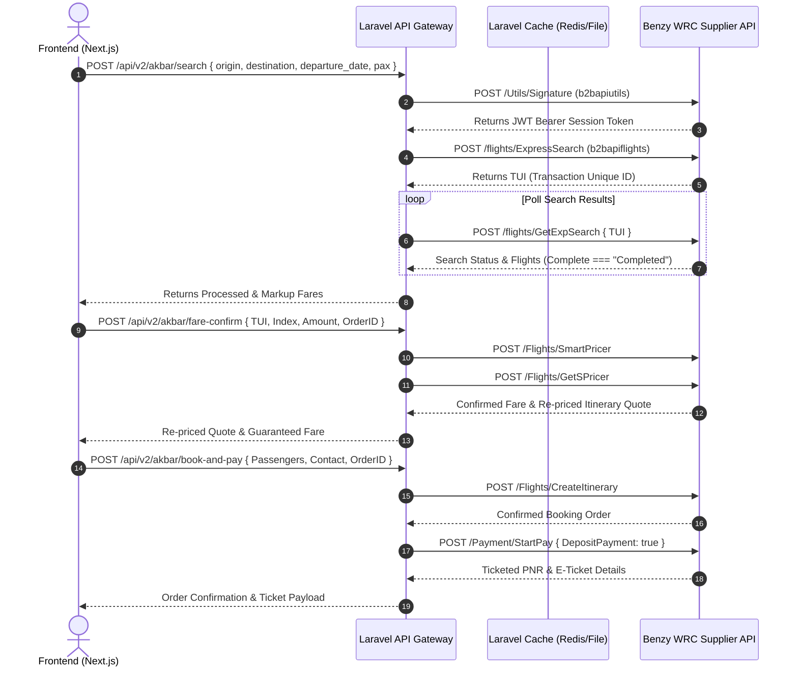

# Tilal Rimal Tourism — Technical Architecture & Backend Developer Documentation

> **Document Version**: 2.0.0  
> **Target Audience**: Technical Leads, Software Engineers, DevOps, System Managers  
> **System Scope**: Laravel 11 Backend API, Akbar Travels (Benzy WRC) B2B Flight Engine, Global Airport Search Service, Next.js Frontend Integration, Payment Processing  
> **Last Updated**: September 2026  

---

## 1. Executive System Overview

The **Tilal Rimal Tourism Platform** is an enterprise-grade travel and tourism solution serving Saudi Arabia and international markets. The architecture follows a decoupled **API-First Microservice Pattern**:

```
 ┌─────────────────────────────────────────────────────────────┐
 │                Next.js 14 Frontend Application              │
 │                (App Router, Server & Client Components)      │
 └──────────────────────────────┬──────────────────────────────┘
                                │ JSON REST API (HTTP/HTTPS)
                                ▼
 ┌─────────────────────────────────────────────────────────────┐
 │                Laravel 11 Backend API Gateway               │
 │        (Routing, Middlewares, Cache, Orchestration)         │
 └─────────────┬──────────────────────────────┬────────────────┘
               │                              │
               ▼                              ▼
 ┌───────────────────────────┐  ┌──────────────────────────────┐
 │ Akbar / Benzy Infotech    │  │ Moyasar Payment Gateway      │
 │ Flight Supplier B2B API   │  │ (Credit Card, Mada, ApplePay)│
 └───────────────────────────┘  └──────────────────────────────┘
```

- **Frontend**: Next.js 14 (`tilalr-update`) using React, Tailwind/Vanilla CSS tokens, i18n localization (EN, AR, ZH), dynamic RTL layout.
- **Backend API Gateway**: Laravel 11 (`tilalr-backend-last`) handling business logic, supplier API orchestration, fare calculations, caching, rate limiting, and database state management.
- **Supplier Integration**: Benzy WRC / Akbar Travels B2B Flight API.
- **Payment Gateway**: Moyasar Payment API integration.

---

## 2. Akbar Travels (Benzy WRC) B2B Flight Integration

### 2.1 Credential & Dual URL Configuration

The integration uses dual base URL routing matching the official Benzy WRC Postman environment setup:

| Key | Config Path | Value / Environment | Description |
| :--- | :--- | :--- | :--- |
| `UtilsURLTest` | `config/services.php -> benzy_wrc.utils_url` | `https://b2bapiutils.benzyinfotech.com` | Base URL for Signature token generation & booking retrieval |
| `FlightURLTest` | `config/services.php -> benzy_wrc.flight_url` | `https://b2bapiflights.benzyinfotech.com` | Base URL for Flight Search, Pricing & Booking execution |
| `AUI` / `MerchantID` | `config/services.php -> benzy_wrc.aui` | `300` | Agency Unique Identifier |
| `ApiKey` | `config/services.php -> benzy_wrc.api_key` | `kXAY9yHARK` | API Access Key |
| `ClientID` | `config/services.php -> benzy_wrc.client_id` | `bitest` | Agency Client ID |
| `Password` | `config/services.php -> benzy_wrc.password` | `staging@1` | Encrypted Secret Credential |
| `BrowserKey` | `config/services.php -> benzy_wrc.browser_key` | `2463db5bcc1bf3f2d8812570fb0321c0` | Session Verification Hash |

---

### 2.2 End-to-End Flight Booking Execution Sequence

The backend implements a multi-step state machine orchestrating requests between the frontend client and Benzy Infotech WRC APIs:



---

## 3. Global 874 Airport Catalog & Real-Time Search API

### 3.1 Backend Data Storage & Caching
- **Storage Location**: `storage/app/akbar_airports.json`
- **Dataset Volume**: 874 verified international and domestic airports (Saudi Arabia, India, UAE, Pakistan, UK, USA, Europe, Asia).
- **Caching Mechanism**: High-performance Laravel Cache key `akbar_airports_catalog` cached for 24 hours (`86400 seconds`).

### 3.2 Backend Service Implementation
- **Service File**: `App\Services\Akbar\AkbarAirportService` (`app/Services/Akbar/AkbarAirportService.php`)
- **Capabilities**:
  - Real-time case-insensitive multi-field search across `Code`, `CityName`, `Name`, `Country`, and `Alias`.
  - Country filtering (`?country=Saudi Arabia`).
  - Adjustable result limits (`?limit=50`).

### 3.3 Backend API Endpoint
- **HTTP Method & URL**: `GET /api/v2/akbar/airports`
- **Route Namespace**: Isolated `v2/akbar` prefix in `routes/api.php`.

#### Sample Request & Response:
```bash
GET http://localhost:8000/api/v2/akbar/airports?q=Jeddah
```

```json
{
  "success": true,
  "count": 1,
  "data": [
    {
      "Code": "JED",
      "Name": "King Abdulaziz International",
      "Alias": "",
      "Country": "Saudi Arabia",
      "CityName": "Jeddah",
      "CityCode": "JED"
    }
  ]
}
```

---

## 4. Isolated V2 Modular Architecture & Middleware Stack

All Akbar Travels flight operations are isolated under the `v2/akbar` namespace in `routes/api.php` to prevent coupling with legacy booking routes:

```php
Route::prefix('v2/akbar')->group(function () {
    // Health & Fault Simulation
    Route::get('/health', [AkbarHealthController::class, 'check']);
    Route::match(['GET', 'POST'], '/mock-simulate', [AkbarMockController::class, 'simulate']);

    // Webhooks
    Route::post('/webhooks/moyasar', [AkbarWebhookController::class, 'handleMoyasar']);

    // Public Catalog
    Route::get('/airports', [AkbarBookingController::class, 'getAirports']);

    // Rate-Limited & Protected Workflows
    Route::middleware([AkbarRateLimiter::class])->group(function () {
        Route::post('/search', [AkbarBookingController::class, 'search']);
        Route::post('/fare-confirm', [AkbarBookingController::class, 'fareConfirm']);
        Route::get('/bundles/{offerId}', [AkbarBookingController::class, 'getBundles']);
        Route::get('/agency-balance', [AkbarBookingController::class, 'agencyBalance']);
        Route::get('/retrieve/{orderId}', [AkbarBookingController::class, 'retrieve']);

        // Idempotent State Mutation Operations
        Route::middleware([AkbarIdempotencyMiddleware::class])->group(function () {
            Route::post('/add-passengers', [AkbarBookingController::class, 'addPassengers']);
            Route::post('/hold', [AkbarBookingController::class, 'hold']);
            Route::post('/book-and-pay', [AkbarBookingController::class, 'bookAndPay']);
        });
    });
});
```

### Key Middlewares Included:
1. **`AkbarRateLimiter`**: Prevents supplier API quota exhaustion and DDoS attacks.
2. **`AkbarIdempotencyMiddleware`**: Enforces unique request headers (`X-Idempotency-Key`) during payment and booking execution to prevent double-charging or duplicate bookings.
3. **Correlation Logging**: Attaches unique `X-Correlation-ID` UUIDs to all outgoing Http requests and system logs (`Log::info`) for complete request tracing.

---

## 5. Frontend Integration & UI/UX Standards

### 5.1 Route Mapping (`tilalr-update`)
- **Search & Results Page**: `http://localhost:3000/en/akbar-flights` (`app/[lang]/akbar-flights/page.jsx` rendering `components/akbarflights/akbarflights.jsx`).
- **Booking & Passenger Checkout**: `http://localhost:3000/en/akbar-flights/booking` (`app/[lang]/akbar-flights/booking/page.jsx`).
- **Authentication Routes**: `http://localhost:3000/en/login` & `http://localhost:3000/en/register`.

### 5.2 Key UI Enhancements Implemented
- **Sticky Header Padding Fix**: Applied `paddingTop: '140px'` to form containers in `login/page.jsx` and `register/page.jsx` to prevent forms from rendering behind the header bar.
- **Time & Date Formatting**:
  - Raw ISO datetimes are converted to clean 24-hour time strings (`06:05`, `08:55`).
  - Return date pickers display formatted labels (e.g. `Wed, 9 Sep`).
- **Spacious Footer Spacing**: Applied explicit bottom margin (`margin: '40px auto 100px auto'`) above footer graphics.
- **Dynamic Debounced Airport Dropdown**: Queries `akbarApi.getAirports(searchQuery)` with 250ms debouncing while maintaining local dataset fallbacks.

---

## 6. Verification & Troubleshooting Commands

### 6.1 Backend API Health Check
```bash
# Check Akbar module health status
curl -X GET http://localhost:8000/api/v2/akbar/health

# Test Airport Search Endpoint
curl -X GET "http://localhost:8000/api/v2/akbar/airports?q=Jeddah"
```

### 6.2 Service Maintenance Commands
```bash
# Clear Laravel Application & Route Caches
php artisan cache:clear
php artisan route:clear
php artisan config:clear

# Restart Background Dev Servers
php artisan serve --port=8000
npm run dev --prefix tilalr-update
```

---

## 7. Developer Contact & Support

For technical queries or architecture reviews, refer to the project repository maintainers:
- **Company**: Tilal Rimal Tourism Organization (شركة تلال الرمال لتنظيم الرحلات السياحية)
- **Commercial License**: `73106935`
- **Contact Email**: `info@tilalrimal.com`
- **Support Hotline**: `+966 54 730 5060`
