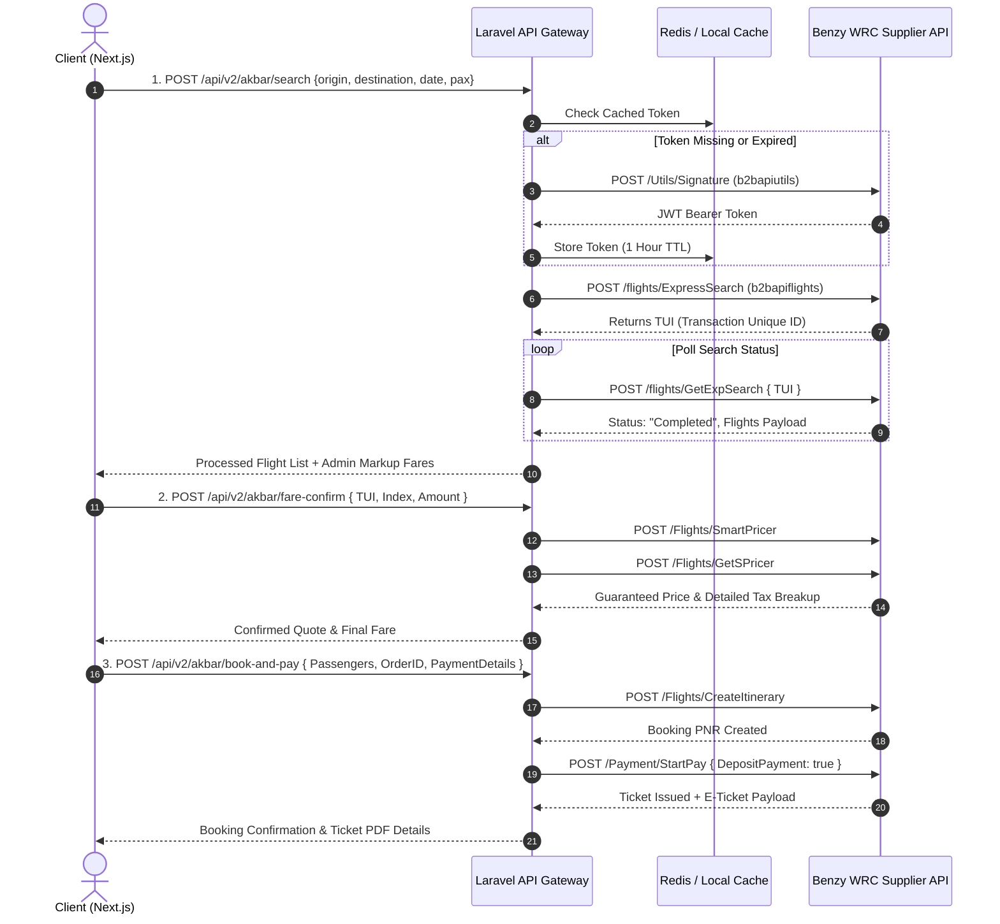
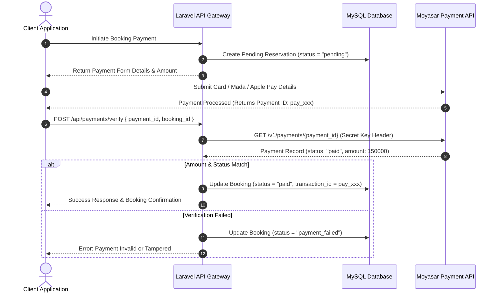

# Tilal Rimal Tourism — Senior Developer Architecture & Onboarding Handbook

> **Author / Lead Architect**: Aman (Backend & Fullstack Engineering Lead)  
> **Document Version**: 3.0.0 (Enterprise Edition)  
> **Target Audience**: Backend Developers, Frontend Engineers, Junior Joiners, Fullstack Colleagues, Technical Leads  
> **System Scope**: Next.js 14 Frontend Application, Laravel 11 Backend API Gateway, Akbar Travels (Benzy WRC) B2B Flight Engine, Moyasar Payment Gateway, eSIM Services, Tourism & Packages Engine, Visa Processing  
> **Last Revision**: September 2026  

---

## 1. Executive Summary & Architecture Philosophy

Welcome to the **Tilal Rimal Tourism Platform** technical engineering reference manual. 

This document serves as the **single source of truth** for all software engineers working on the platform. It is designed to ensure that any developer—whether junior, peer, or senior—can immediately understand **where code is called**, **how services interact**, **what technologies are used**, and **how to handle future technical challenges** without ambiguity.

### 1.1 High-Level Microservice Architecture Diagram

The system adopts a decoupled, **API-First Microservice Pattern**:

```
┌────────────────────────────────────────────────────────────────────────────────────────┐
│                                 Next.js 14 Frontend Client                             │
│                         (App Router, React 18, Tailwind / Vanilla CSS)                  │
└───────────────────────────────────────────┬────────────────────────────────────────────┘
                                            │ REST API (JSON over HTTPS)
                                            ▼
┌────────────────────────────────────────────────────────────────────────────────────────┐
│                              Laravel 11 API Gateway Layer                              │
│         (Routing, Throttle, Idempotency, Sanctum Auth, Response Formatter, Middleware)   │
└──────────┬────────────────────┬────────────────────┬────────────────────┬──────────────┘
           │                    │                    │                    │
           ▼                    ▼                    ▼                    ▼
┌────────────────────┐ ┌──────────────────┐ ┌──────────────────┐ ┌───────────────────┐
│ Akbar / Benzy WRC  │ │ Moyasar Payment  │ │ Tourism & Package│ │ Visa & eSIM       │
│ Flight Supplier    │ │ API Gateway      │ │ Engine (MySQL)   │ │ Processing Engine │
└────────────────────┘ └──────────────────┘ └──────────────────┘ └───────────────────┘
```

### 1.2 Core Technology Stack

| Component | Technology | Version | Purpose |
| :--- | :--- | :--- | :--- |
| **Frontend Framework** | Next.js | 14.x | App Router client application (`tilalr-update`) |
| **Backend Framework** | Laravel | 11.x | REST API Gateway, Routing, Business Logic, Middleware (`tilalr-backend-last`) |
| **Runtime Language** | PHP / JS | PHP 8.2+ / Node 18+ | Server & Client execution |
| **Database** | MySQL | 8.0+ | Relational Data Storage (Users, Bookings, Transactions, Offers) |
| **Caching Layer** | Redis / File | 7.x / File | Airport catalog caching, API session token caching, Rate limiting |
| **Authentication** | Laravel Sanctum / OTP | 4.x | Token-based auth for mobile & web apps, SMS verification |
| **Flight Supplier API** | Benzy WRC (Akbar Travels) | B2B REST v2 | Live flight search, pricing, seat allocation, deposit ticketing |
| **Payment Gateway** | Moyasar Payment API | v1 | Mada, Credit Cards, Apple Pay processing & Webhooks |

---

## 2. Directory Structure & "Where Do I Call / Find X?" Master Map

When joining the team or adding new features, use this lookup matrix to quickly find where components live.

### 2.1 Complete File Lookup Matrix

| Feature / Subsystem | Backend Controller / Service File | Route Endpoint (`routes/api.php`) | Frontend Integration File (`tilalr-update`) |
| :--- | :--- | :--- | :--- |
| **Flight Search & Results** | `app/Http/Controllers/Api/Akbar/AkbarBookingController.php` (`search()`) | `POST /api/v2/akbar/search` | `app/[lang]/akbar-flights/page.jsx` |
| **Airports Auto-Complete** | `app/Services/Akbar/AkbarAirportService.php` | `GET /api/v2/akbar/airports` | `components/akbarflights/akbarflights.jsx` |
| **Flight Re-Pricing & Confirm** | `AkbarBookingController.php` (`fareConfirm()`) | `POST /api/v2/akbar/fare-confirm` | `components/akbarflights/BookingModal.jsx` |
| **Flight Booking & Ticketing** | `AkbarBookingController.php` (`bookAndPay()`) | `POST /api/v2/akbar/book-and-pay` | `app/[lang]/akbar-flights/booking/page.jsx` |
| **Moyasar Payment Callback** | `app/Http/Controllers/Api/PaymentController.php` | `POST /api/payments/verify` | `app/[lang]/payment-confirmation/page.jsx` |
| **Moyasar Webhook Listener** | `app/Http/Controllers/Api/Akbar/AkbarWebhookController.php` | `POST /api/v2/akbar/webhooks/moyasar` | Server-to-Server (Moyasar API) |
| **User Registration & Login** | `app/Http/Controllers/Api/AuthController.php` | `POST /api/register`, `POST /api/login` | `app/[lang]/login/page.jsx`, `register/page.jsx` |
| **SMS & Mobile OTP** | `app/Http/Controllers/Api/OtpController.php` | `POST /api/auth/send-otp`, `/verify-otp` | `components/auth/OtpModal.jsx` |
| **Tourism Packages & Offers** | `app/Http/Controllers/Api/TourismOfferController.php` | `GET /api/tourism-offers` | `app/[lang]/offers/page.jsx` |
| **Custom Package Booking** | `app/Http/Controllers/Api/BookingController.php` | `POST /api/bookings/guest` | `components/booking/PackageBookingForm.jsx` |
| **Visa Applications (Saudi/Schengen)** | `SaudiVisaController.php`, `SchengenController.php` | `POST /api/visa-applications`, `/schengen` | `app/[lang]/visa/page.jsx` |
| **Internet & eSIM Packages** | `InternetPackageRequestController.php` | `POST /api/internet-packages` | `app/[lang]/esim/page.jsx` |

---

## 3. Core Workflows & Technical Deep Dives

### 3.1 Akbar Travels (Benzy WRC) Live Flight Flow

The flight subsystem is built on a 4-step state machine communicating with Benzy Infotech APIs.



### 3.2 Payment Gateway Flow (Moyasar + Booking Reconciliation)



---

## 4. Senior Developer FAQ & Code Recipes ("Ask Aman")

When team members ask you questions, here are the official architectural answers and standards:

### Q1: "How do I add a new API route and Controller method?"
**Answer:**
1. **Create Controller**: Place API controllers in `app/Http/Controllers/Api/`. Use clean Single-Responsibility Methods.
2. **Request Validation**: Use Laravel Form Request Validation (`app/Http/Requests/`) or `$request->validate([...])` at the top of the controller method.
3. **Route Registration**: Open `routes/api.php`. Add your route under the appropriate middleware group (e.g. Sanctum auth or Throttle rate limit).
4. **Standard JSON Response Format**: Always return a standardized response:
```php
return response()->json([
    'success' => true,
    'message' => 'Resource created successfully',
    'data'    => $result,
], 200);
```

---

### Q2: "How are flight markups and currency conversions calculated?"
**Answer:**
- Markups are controlled dynamically via the database/configuration and applied inside `AkbarBookingController.php`.
- When raw supplier prices are returned from Benzy Infotech, the service applies:
  $$\text{Final Price} = (\text{Supplier Fare} \times (1 + \frac{\text{Markup \%}}{100})) + \text{Fixed Fee}$$
- All prices returned to the frontend client are in **Saudi Riyal (SAR)** unless specified otherwise.

---

### Q3: "Where are third-party API credentials stored?"
**Answer:**
- Credentials **must NEVER be hardcoded** in PHP files.
- Store keys in `.env`:
  ```ini
  BENZY_UTILS_URL=https://b2bapiutils.benzyinfotech.com
  BENZY_FLIGHT_URL=https://b2bapiflights.benzyinfotech.com
  BENZY_API_KEY=kXAY9yHARK
  BENZY_CLIENT_ID=bitest
  MOYASAR_SECRET_KEY=sk_test_...
  ```
- Map them in `config/services.php`:
  ```php
  'benzy_wrc' => [
      'utils_url'  => env('BENZY_UTILS_URL'),
      'flight_url' => env('BENZY_FLIGHT_URL'),
      'api_key'    => env('BENZY_API_KEY'),
  ],
  ```

---

### Q4: "How do we handle image uploads for tourism packages and offer banners?"
**Answer:**
- Images are processed in `app/Http/Controllers/Api/CustomPaymentOfferController.php` and stored in `public/uploads/` or `storage/app/public/`.
- Ensure symbolic links are active by running: `php artisan storage:link`.
- Full public URLs are generated dynamically using `asset('storage/' . $path)`.

---

## 5. Technical Challenges, Future Roadmaps & Senior Edge Case Handling

As a Senior Developer, you must anticipate production failure modes and implement defensive engineering practices. Below are the key future difficulties and their technical solutions.

### 5.1 Challenge 1: Supplier API Timeout & Quota Exhaustion
- **Risk**: Benzy Infotech supplier servers might experience latency surges during peak travel seasons, leading to 504 Gateway Timeouts on Next.js.
- **Senior Solution**:
  - Implement a **Circuit Breaker Pattern** using Redis. If supplier calls fail > 5 times in 1 minute, fail gracefully with a cached response or notification.
  - Enforce strict Guzzle HTTP timeouts (`'timeout' => 8.0`, `'connect_timeout' => 3.0`).

### 5.2 Challenge 2: Double Payment & Webhook Race Conditions
- **Risk**: A user clicks "Pay" twice rapidly, or a Moyasar webhook arrives *at the exact same microsecond* as the frontend callback.
- **Senior Solution**:
  - Enforce `AkbarIdempotencyMiddleware` using the `X-Idempotency-Key` HTTP header.
  - Wrap payment updates in atomic database transactions with row-level locks:
    ```php
    DB::transaction(function () use ($bookingId, $paymentId) {
        $booking = Booking::where('id', $bookingId)->lockForUpdate()->first();
        if ($booking->status === 'paid') {
            return; // Prevent duplicate execution
        }
        $booking->update(['status' => 'paid', 'transaction_id' => $paymentId]);
    });
    ```

### 5.3 Challenge 3: Database Indexing & High-Traffic Search Scaling
- **Risk**: Search queries for flight routes or tourism destinations slow down as tables grow past 500,000 records.
- **Senior Solution**:
  - Ensure composite indexes exist on heavily filtered columns:
    ```sql
    ALTER TABLE bookings ADD INDEX idx_user_status (user_id, status);
    ALTER TABLE tourism_offers ADD INDEX idx_slug_active (slug, is_active);
    ```

### 5.4 Challenge 4: Multi-Language (i18n) Synchronization
- **Risk**: Data added in Arabic is missing in English or Chinese, breaking Next.js locale routing (`app/[lang]/`).
- **Senior Solution**:
  - Use JSON translation fields in database tables (e.g. `title = {"en": "Dubai Luxury Tour", "ar": "جولة دبي الفاخرة"}`).
  - Provide fallback logic in Laravel Eloquent accessors so that if an AR string is missing, it seamlessly falls back to EN.

---

## 6. Local Development Setup & Verification Cheat Sheet

### 6.1 Prerequisites
- **PHP**: 8.2 or higher
- **Composer**: 2.x
- **MySQL**: 8.0+
- **Node.js**: 18.x or 20.x

### 6.2 Initial Installation Steps

```bash
# 1. Clone & Navigate to Backend
cd tilalr-backend-last

# 2. Install PHP Dependencies
composer install

# 3. Environment File Setup
cp .env.example .env
php artisan key:generate

# 4. Run Database Migrations & Seeders
php artisan migrate --seed

# 5. Create Storage Link for Media Uploads
php artisan storage:link

# 6. Start Local Development Server
php artisan serve --port=8000
```

### 6.3 Maintenance & Troubleshooting Commands

```bash
# Clear all Laravel Caches (Use when routes or configs are updated)
php artisan config:clear
php artisan route:clear
php artisan cache:clear

# View Active API Routes
php artisan route:list --path=api

# Run System Health Check Endpoint
curl -X GET http://localhost:8000/api/health
```

---

## 7. Code Quality & Contribution Standards

To maintain high code quality across the team:
1. **Naming Conventions**: Use `CamelCase` for Controllers and Services, `snake_case` for database columns and route parameters.
2. **Type Hints**: Use strict PHP 8 typings (`public function search(FlightSearchRequest $request): JsonResponse`).
3. **Logging**: Log all third-party API errors using structured context (`Log::error('Benzy API Error', ['endpoint' => $url, 'response' => $e->getMessage()])`).

---

*This document is maintained by the Lead Backend Engineer. For architecture suggestions or updates, submit a PR to `SENIOR_BACKEND_HANDBOOK_AND_ONBOARDING.md`.*
